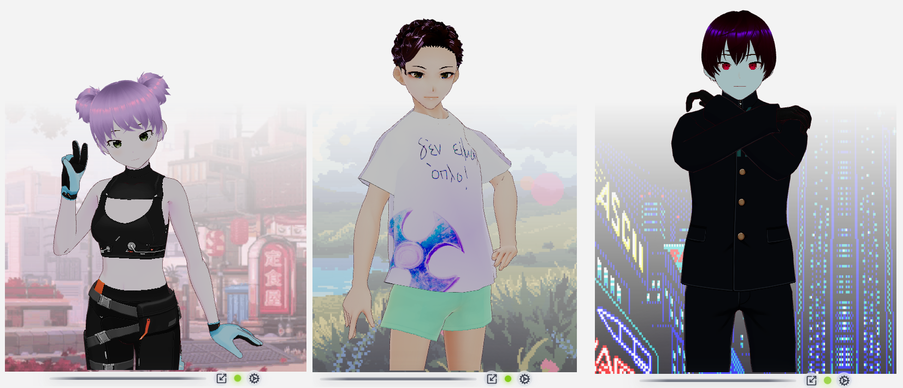

<div align="center">
  
</div>

<p align="center">
  <b>Give a face to your AI — and anything else you listen to.</b>
</p>

<p align="center">&nbsp;</p>

<div align="center">
  <a href="https://github.com/ARPAHLS/avatar/releases/download/v0.3.0/AVATAR-Setup-0.3.0.exe"></a>
  <a href="LICENSE"></a>
  <a href="https://vrm.dev/ja/"></a>
</div>

<p align="center">&nbsp;</p>

<p align="center">
  Animate cloud APIs, web apps, or local LLMs with a VRM character that lipsyncs and moves while you work.<br />
  Or keep a companion on screen while you study, watch a video, hear a podcast, speech, or audiobook — a character that follows the audio instead of a blank background.
</p>

<p align="center">
  
</p>

<p align="center">
  <a href="#quick-start">Quick Start</a> ·
  <a href="https://github.com/ARPAHLS/avatar/releases/download/v0.3.0/AVATAR-Setup-0.3.0.exe">Download .exe</a> ·
  <a href="docs/using-the-app.md">User guide</a> ·
  <a href="docs/README.md">Documentation</a> ·
  <a href="docs/getting-started/installation.md">Install</a> ·
  <a href="docs/avatars-and-skins.md">Avatars</a> ·
  <a href="docs/environments.md">Environments</a> ·
  <a href="docs/voice/audio-sources.md">Voice</a> ·
  <a href="docs/vroid-hub.md">VRoid Hub</a> ·
  <a href="docs/animations/vrma.md">Animations</a> ·
  <a href="docs/user-settings.md">Settings</a> ·
  <a href="docs/assets-and-credits.md">Assets & Credits</a> ·
  <a href="CHANGELOG.md">Changelog</a> ·
  <a href="CITATION.cff">Cite</a>
</p>

---

**AVATAR** is an open-source **desktop companion** from ARPA. The primary experience is the **Electron** transparent always-on-top overlay. A Windows **[`.exe` installer](https://github.com/ARPAHLS/avatar/releases/download/v0.3.0/AVATAR-Setup-0.3.0.exe)** is available for end users. The browser / localhost Vite app is for **development and contributors**.

It renders `.vrm` models, plays `.vrma` motion, and drives mouth shapes from live audio — including system / device output on desktop.

## What this is

- **Electron desktop overlay** — pin, snap, window scale, device loopback ([user guide](docs/using-the-app.md) · [settings](docs/user-settings.md))
- **VRM avatars & skins** — drop-in `avatarN.vrm` / `avatarNB.vrm` ([avatars](docs/avatars-and-skins.md))
- **VRoid Hub (optional)** — bring-your-own OAuth app; connect in Settings, pick characters in Appearance ([VRoid Hub](docs/vroid-hub.md))
- **Environments** — built-ins, local Custom folder, color fade, or none ([environments](docs/environments.md))
- **Persistent settings** — `config.yaml` across launches ([user settings](docs/user-settings.md))
- **VRMA animations** — Default greeting + loop, plus clips ([VRMA](docs/animations/vrma.md))
- **Browser / localhost** — optional for contributors ([install](docs/getting-started/installation.md))

<p align="center">
  
</p>

## Quick start

### 1. Windows installer (easiest)

Download **[AVATAR-Setup-0.3.0.exe](https://github.com/ARPAHLS/avatar/releases/download/v0.3.0/AVATAR-Setup-0.3.0.exe)** — no Node.js. Run the installer, accept the EULA, launch **AVATAR**.

([All releases](https://github.com/ARPAHLS/avatar/releases) · [install notes](docs/getting-started/installation.md))

### 2. Desktop from source (Electron)

Requires **Node.js 20+** and **npm**:

```bash
cd avatar-demo
npm install
npm run desktop
```

### 3. Web app (browser)

```bash
cd avatar-demo
npm install
npm run dev
```

Open [http://localhost:5173](http://localhost:5173). Prefer Electron when testing lip sync against system audio.

---

Gear menu: Appearance (Avatars · Skins · Environments) · Voice · Camera · Animations · Settings. Scale control sits next to the gear.

**First launch behavior:** Greeting once, then a looping motion set; desktop audio defaults to device output; preferences restore from `config.yaml` on later launches. Full walkthrough: [Using the app](docs/using-the-app.md) · [First session](docs/getting-started/first-session.md).

<p align="center">
  
  
</p>

### Try lip sync

1. Gear → **Voice** → Device output (desktop) or Microphone / Tab (browser)
2. Green pulsating dot next to the gear = active

More: [Audio sources](docs/voice/audio-sources.md) · [Lip sync](docs/voice/lip-sync.md) · [Using the app → Voice](docs/using-the-app.md#4-voice--lip-sync)

<p align="center">
  
  
</p>

### Try animations

Gear → **Animations** → **Default** (greeting, then motion loop). Catalog: [VRMA animations](docs/animations/vrma.md).

<p align="center">
  
</p>

### Swap avatars

Drop `avatar4.vrm` (or `avatar1B.vrm` for a skin) into `avatar-demo/src/assets/avatars/`, restart desktop, pick it under Appearance. See [Avatars & skins](docs/avatars-and-skins.md).

### Custom environments (local)

Drop trial GIFs into `avatar-demo/src/assets/environments/custom/` (gitignored — local only; not shipped in the Windows installer). Restart, open Appearance → Environments → **Custom**. Details: [Environments](docs/environments.md).

## Documentation

| Topic | Links |
| :--- | :--- |
| **User guide** | [Using the app](docs/using-the-app.md) — every menu, default, and reset |
| **Getting started** | [Install](docs/getting-started/installation.md) · [First session](docs/getting-started/first-session.md) |
| **Download** | [AVATAR-Setup-0.3.0.exe](https://github.com/ARPAHLS/avatar/releases/download/v0.3.0/AVATAR-Setup-0.3.0.exe) · [v0.3.0 release](https://github.com/ARPAHLS/avatar/releases/tag/v0.3.0) |
| **Characters & stage** | [Avatars & skins](docs/avatars-and-skins.md) · [Environments](docs/environments.md) · [Camera & lighting](docs/camera-and-lighting.md) |
| **Motion & voice** | [VRMA](docs/animations/vrma.md) · [Audio sources](docs/voice/audio-sources.md) · [Lip sync](docs/voice/lip-sync.md) |
| **VRoid Hub** | [Opt-in OAuth connection](docs/vroid-hub.md) — bring your own OAuth app, sign in, use a licensed character |
| **Settings** | [config.yaml & resets](docs/user-settings.md) |
| **Architecture** | [Overview](docs/architecture/overview.md) · [Layout](docs/development/project-layout.md) |
| **Assets** | [Assets & credits](docs/assets-and-credits.md) |
| **Cite** | [CITATION.cff](CITATION.cff) · [Changelog](CHANGELOG.md) |

## Repository layout

```text
avatar/
├── docs/
│   ├── using-the-app.md
│   ├── screenshots/          # product media for README & guides
│   └── …
├── avatar-demo/
│   ├── electron/
│   ├── public/
│   └── src/
│       ├── assets/avatars/
│       └── assets/environments/
│           ├── stars.gif / code.gif / bloom.gif
│           └── custom/         # local trials only (gitignored media)
├── CHANGELOG.md
├── CITATION.cff
└── README.md
```

## Assets & licensing (summary)

Sample characters are made in **VRoid Studio** / **VRoid Hub** with free setups — **no paid models or wearables** are used in this repo.

Bundled motions are the **7 free VRMA files** from the **VRoid Project** on [BOOTH](https://booth.pm/) (2024). Copyright remains with **pixiv Inc.** Commercial use requires:

> Animation credits to pixiv Inc.'s VRoid Project  
> （キャラクターアニメーション: ピクシブ株式会社 VRoidプロジェクト）

Full terms: **[docs/assets-and-credits.md](docs/assets-and-credits.md)** · Rights holders: **input@arpacorp.net**

## Privacy

Runs locally. Audio uses Web APIs / Electron loopback; nothing is uploaded. See [audio sources](docs/voice/audio-sources.md) for capture options.

---

<div align="center">
  
  <br />
  <sub>Built & Maintained by <strong>ARPA Hellenic Logical Systems</strong></sub>
</div>
