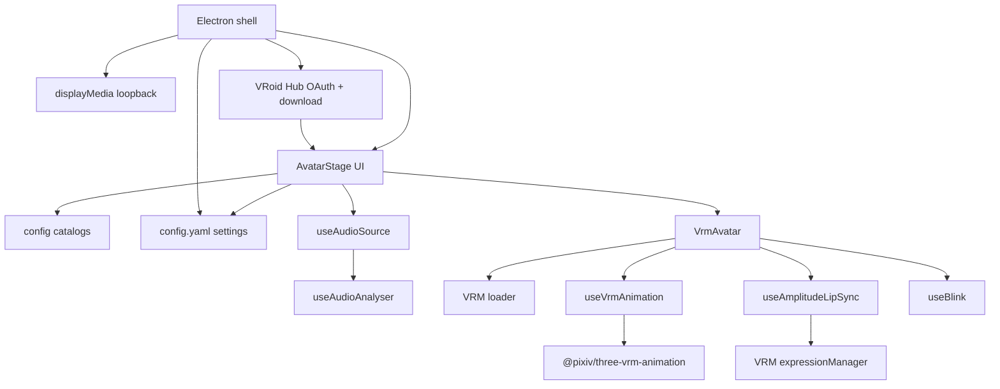

# Architecture overview

## Layers

### Presentation (`components/`)

`AvatarStage` owns the stage, gear menus, glass drawers, window scale, and settings hydration. Panels:

| Panel | Contents |
| :--- | :--- |
| `PalettePanel` | Avatar picker (built-ins + optional VRoid Hub grid), Environments |
| `VoicePanel` | Audio source / lip sync controls |
| `CameraPanel` | Camera, light, avatar transform |
| `DesktopPanel` | Overlay toggle + 3×3 snap pad |
| `DirectoriesPanel` | Custom avatar / animation / environment folders (desktop) |
| `VroidHubPanel` | OAuth credentials / connect (Settings) and Hub character pick (Appearance) |
| Settings drawer | Overlay, Snap, Directories, VRoid Hub, System (**Reset all settings**) |

### Configuration (`config/`)

Catalogs for avatars, animations (including the Default sequence), audio sources, environments, window scale, visual defaults, and the `userSettings` schema.

The animation catalog is split so its lookups stay unit-testable: `vrmaAssets.js` holds the Vite-resolved `.vrma` imports, `animationLookup.js` the pure catalog lookups (no asset imports, so plain `node --test` can load it), and `animations.js` composes both and re-exports them as the single entry point. Every lookup takes the catalog it should read, because a custom animations folder replaces the bundled list at runtime.

### Runtime hooks (`hooks/`)

| Hook | Role |
| :--- | :--- |
| `useVrmAnimation` | Loads `.vrma`, sequences, cross-fades |
| `useAmplitudeLipSync` | Maps audio level → cycling visemes |
| `useAudioSource` | Capture lifecycle (browser + Electron) |
| `useBlink` | Idle blink on expression manager |

### Desktop (`electron/`)

Frameless transparent window, always-on-top overlay, snap, scale presets, system audio loopback via `setDisplayMediaRequestHandler`, **`config.yaml`** persistence in Electron `userData` (`settingsStore.cjs`), and optional **VRoid Hub** OAuth (loopback callback server + encrypted credentials / tokens + licensed model download).

## Design notes

- **Electron first** — desktop overlay, scale, and device loopback are the primary product path; browser is for development.
- **VRMA first** — skeletal clips (and sequences) drive the body while active.
- **Drop-in avatars** — `avatarN.vrm` naming auto-registers models.
- **VRoid Hub optional** — bring-your-own OAuth app; Hub VRMs are session-only in memory (not in `config.yaml`).
- **Persistent prefs** — avatar, camera, lighting, environment, animation, audio source, overlay, scale, and directories survive restarts; reset from Settings.
- **Chrome contrast** — whitish bar/buttons on dark backdrops; silver only when the region behind the bar is clearly light.
- **Future triggers** — keyword/event mapping will reuse the same animation catalog.
