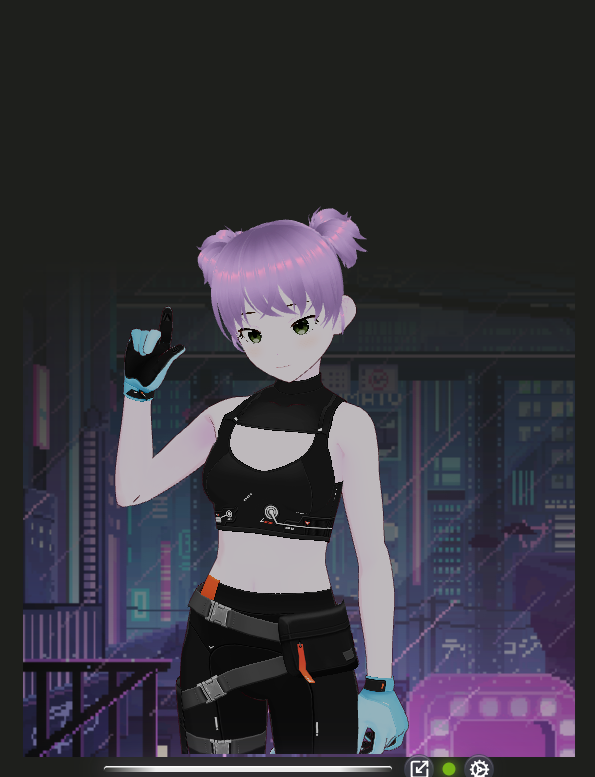

# Avatars & skins

## Bundled characters

| UI label | File |
| :--- | :--- |
| Avatar 1 | `avatar1.vrm` |
| Avatar 2 | `avatar2.vrm` |
| Avatar 3 | `avatar3.vrm` |

Path: `avatar-demo/src/assets/avatars/`.

Gear → **Appearance** → **Avatars**. Selection persists as `avatarId` in [config.yaml](user-settings.md).

  

  
  
  

  

---

## Drop-in naming

| Pattern | Meaning |
| :--- | :--- |
| `avatarN.vrm` | New character **Avatar N** (N = 1, 2, 3, …) |
| `avatarNB.vrm` | Skin **B** for Avatar N |
| `avatarNC.vrm` | Skin **C**, and so on |

Vite’s glob picks them up after restart. No manual registry edit for basic drop-ins.

---

## Skins

Gear → **Appearance** → **Skins**.

- Shows skins for the **currently selected** avatar only.  
- Each avatar has at least **Default** (the base `avatarN.vrm`).  
- Extra lettered files unlock Skin B / C / …  

  

Example: `avatar1B.vrm` → while Avatar 1 is selected, Skins lists Default + Skin B.

---

## VRoid Hub characters (optional)

On the **desktop** app you can connect your own VRoid Hub OAuth app and load
characters you own (or hearted models available to other users) without
dropping a `.vrm` into `src/assets/avatars/`.

| Where | What |
| :--- | :--- |
| Gear → **Settings** | Register / paste OAuth credentials, Connect / Disconnect |
| Gear → **Appearance** → **Avatars** | Built-ins **plus** Hub portraits once connected |

Hub characters are **session-only** (held in memory, not saved to
`config.yaml` or disk). Full walkthrough: [VRoid Hub connection](vroid-hub.md).

  

  

---

## Framing

All avatars share the same default camera (`X = -0.01`, `Y = 0.59`, …). If a new model sits high/low, use **Camera & Lighting** or that model’s own VRM ground offset. See [Camera & lighting](camera-and-lighting.md).

---

## Credits & licenses

Third-party VRM / texture licenses: [Assets & credits](assets-and-credits.md). Contact `input@arpacorp.net` for contribution questions.

Linked Hub models keep their authors’ VRoid Hub conditions of use — review
them in-app before using a hearted character.
