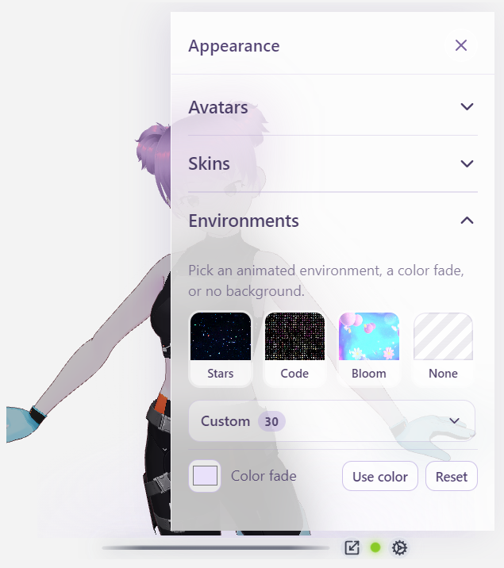
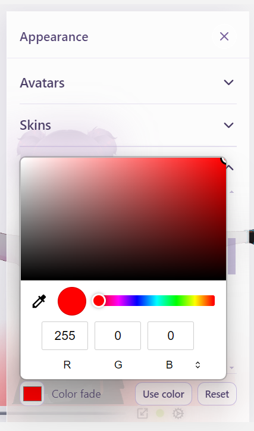
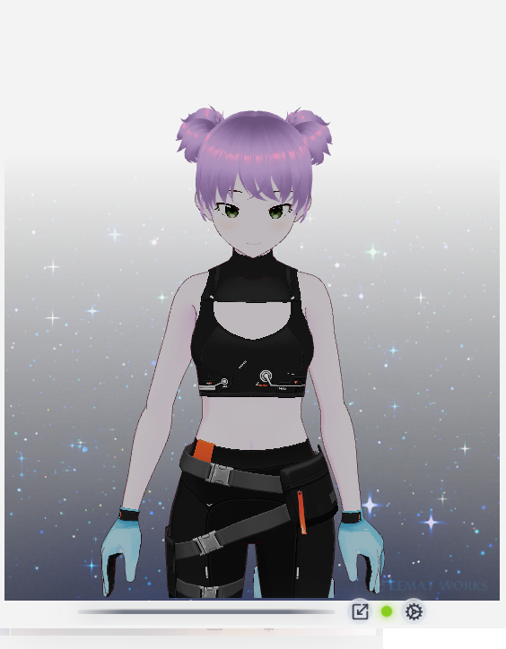
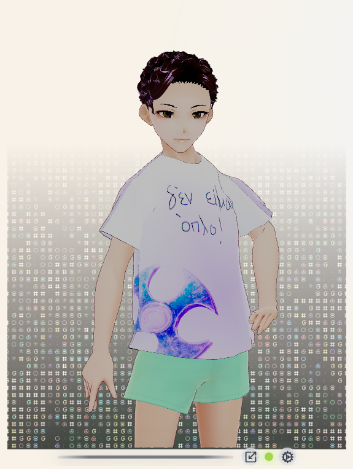
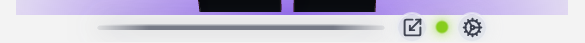

# Environments

Backgrounds live under `avatar-demo/src/assets/environments/`.

Open Gear → **Appearance** → **Environments**.

  
  

---

## Built-in

| Id | Label | File | Look |
| :--- | :--- | :--- | :--- |
| `stars` | Stars | `stars.gif` | Dark starfield |
| `code` | Code | `code.gif` | Code rain |
| `bloom` | Bloom | `bloom.gif` | Bright pastel bloom |
| — | None | — | No GIF / glow — desktop shows through in overlay |
| — | Color fade | — | Soft radial glow from a hex color |

  
  
  
  

  

### Color fade

1. Pick a color.  
2. Click **Use color**.  
3. **Reset** restores lavender `#e9e1fa`.

The Color fade row stays pinned under the environment list (**Use color** + **Reset** on one line).

---

## Custom GIFs (local only)

The `custom/` folder is for **your** trial media. Files inside it are **not** committed to git (the empty folder is kept via `.gitkeep`).

### How to use

1. Drop media into `avatar-demo/src/assets/environments/custom/`  
   (`.gif`, `.webp`, `.png`, `.jpg`, `.jpeg`, `.jfif`).  
2. Restart Vite / Electron so Vite’s glob picks them up.  
3. Gear → Appearance → Environments → open **Custom**.

While Custom is open, built-in thumbs (Stars / Code / Bloom / None) hide so the library has room; close Custom to show them again. Scroll the Custom grid; Color fade stays visible underneath.

  

Labels come from the filename. Keep trials here; when you want a permanent built-in, copy a keeper next to `stars.gif` / `code.gif` / `bloom.gif` and register it in `src/config/environments.js`.

---

## Contrast (bar & buttons)

The glass bar sits over the **desktop** (overlay) or the window chrome (windowed). Colors adapt:

| Backdrop | Bar | Buttons |
| :--- | :--- | :--- |
| Dark | Whitish | Darker grey glass + white icons |
| Light | Grey | Lighter grey glass + dark icons |

  
  
  

- **Overlay:** samples desktop luminance near the window when the window **settles** after a move/snap (and on focus) — not on a continuous timer. Chrome colors still crossfade smoothly.  
- **Browser / windowed:** uses the environment (e.g. Bloom → light chrome; Stars/Code/None → dark).

Custom images are sampled on their lower strip when environment-based tone is used.

---

## Asset location

Do **not** put environment GIFs only in `public/` — the app imports from `src/assets/environments/` so Vite can bundle them.

Built-ins (`stars.gif`, `code.gif`, `bloom.gif`) ship with the repo. **`custom/` media stays on your machine.**

See also: [Using the app](using-the-app.md).
