# Using AVATAR — complete user guide

This guide walks through every control in the **Electron desktop companion**. Prefer the [Windows installer](https://github.com/ARPAHLS/avatar/releases/download/v0.2.0/AVATAR-Setup-0.2.0.exe) when you can. From source: `npm run desktop`. Browser / localhost (`npm run dev`) is for contributors; some desktop-only features (overlay, device loopback, window scale, snap pad) are unavailable or limited there.

**Related:** [Installation](getting-started/installation.md) · [User settings / config.yaml](user-settings.md)

---

## 1. What you see on launch

1. A transparent **always-on-top** window appears (overlay mode).
2. The avatar loads (**Avatar 1** by default).
3. Motion starts on **Default**:
   - **Greeting** plays once
   - Then a loop forever: **Model Pose → Show Full Body → Peace Sign → Squat → Shoot**
4. On desktop, **audio** defaults to **Device output (auto)** so lip sync can follow system sound when capture is active.
5. Environment defaults to a soft **lavender color fade** (`#e9e1fa`).
6. Preferences from a previous session load from **`config.yaml`** if present (see [User settings](user-settings.md)).

Glass **bar** at the bottom: drag handle (line), **window scale**, optional green **live** dot, **gear** menu.

<p align="center">
  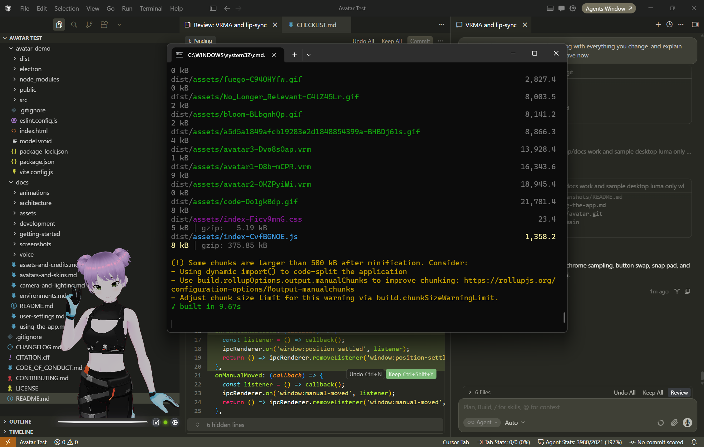
</p>

<p align="center">
  
</p>

<p align="center">
  
  
</p>

---

## 2. Glass bar

### Move the window

- Drag the **horizontal glass line**.
- Or open **Settings** and use the **3×3 snap pad** to jump to a screen position.

### Window scale (desktop)

Tap the **Scaling** control (left of the live dot / gear). Choose:

| Preset | Effect |
| :--- | :--- |
| **×0.5** | Half size |
| **×1** | Default (~420×560 logical) |
| **×2** | Double size |

Scale is remembered in `config.yaml`.

<p align="center">
  
</p>

<p align="center">
  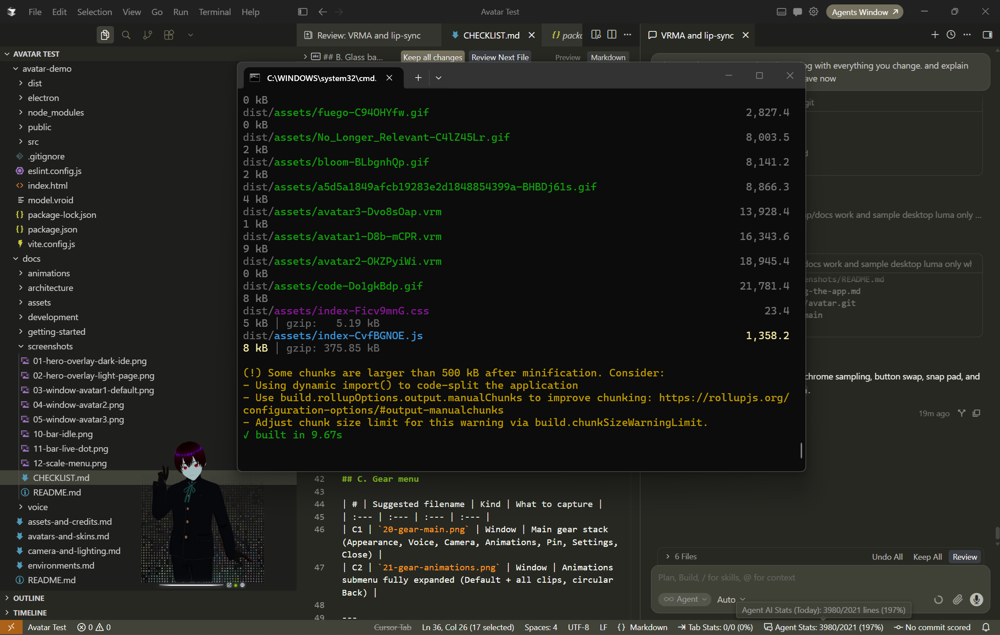
</p>

<p align="center">
  
</p>

<p align="center">
  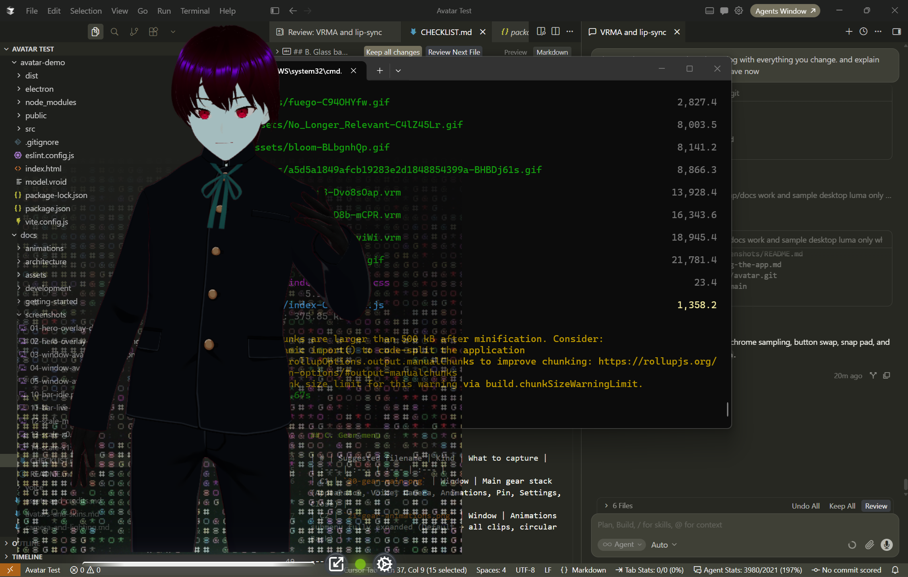
</p>

### Live lip-sync dot

A **green pulsing dot** appears when lip sync is actively capturing (`Audio source` not Off, status `active`). Hover title: *Lip sync active*.

### Gear menu

| Item | Opens / does |
| :--- | :--- |
| **Appearance** | Avatars, skins, environments |
| **Voice** | Audio source / lip sync |
| **Camera & Lighting** | Camera, lights, avatar transform |
| **Animations** | Submenu of clips (no drawer) |
| **Pinned / Windowed** | Toggle overlay vs opaque window (desktop) |
| **Settings** | Overlay, snap pad, reset all, config path |
| **Close** | Quit the companion window (desktop) |

<p align="center">
  
  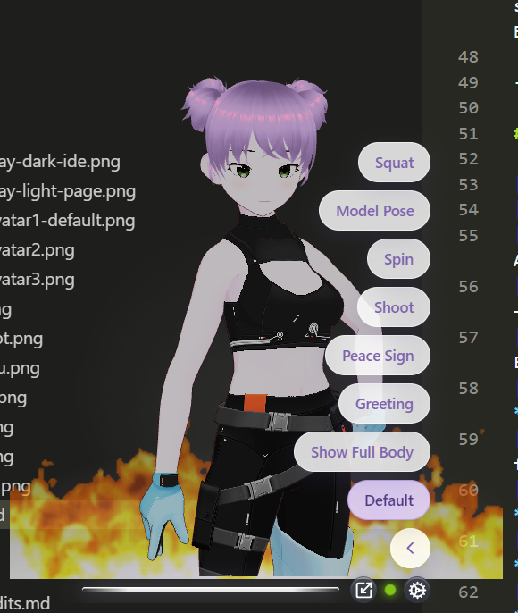
</p>

---

## 3. Appearance

Gear → **Appearance**.

### Avatars

Pick **Avatar 1 / 2 / 3** (files `avatar1.vrm`, `avatar2.vrm`, `avatar3.vrm`).  
Drop more models named `avatar4.vrm`, … — they appear automatically. Details: [Avatars & skins](avatars-and-skins.md).

<p align="center">
  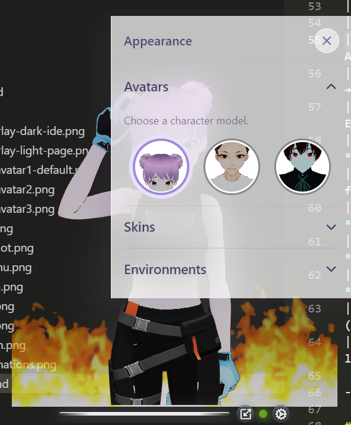
  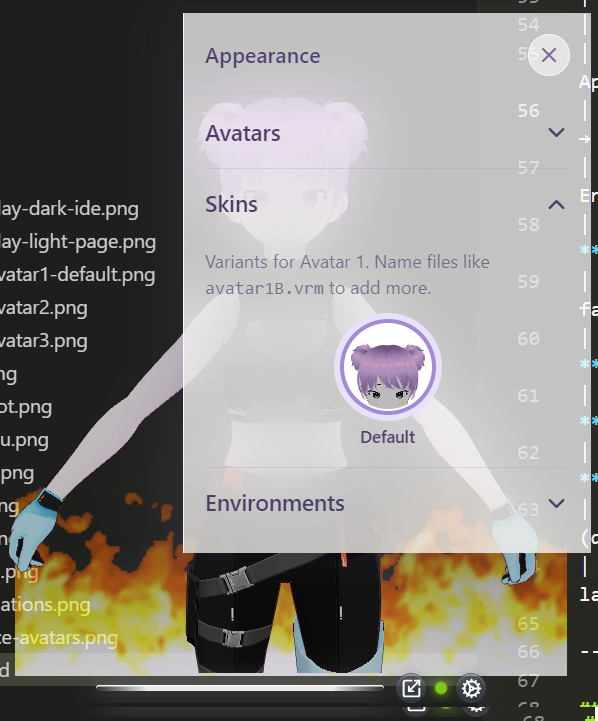
</p>

### Skins

Variants for the **currently selected** avatar. Today each ships with **Default**.  
Add `avatar1B.vrm`, `avatar1C.vrm`, … for Skin B / C on Avatar 1.

### Environments

| Option | What you get |
| :--- | :--- |
| **Stars** | Dark starfield GIF |
| **Code** | Code-rain GIF |
| **Bloom** | Bright pastel GIF (bar often switches to “light” chrome) |
| **None** | No stage backdrop — desktop shows through (overlay) |
| **Custom** | Local GIFs/images in `src/assets/environments/custom/` (dev only; **not** shipped in the Windows installer). Opening Custom hides built-ins until closed; Color fade stays pinned under the list |
| **Color fade** | Soft glow from a color you pick → **Use color** |
| **Reset** | Back to lavender `#e9e1fa` |

<p align="center">
  
  
</p>

Full detail: [Environments](environments.md).

### Bar & button colors (chrome)

The bar and circular controls adapt to what sits **behind** the bar:

| Backdrop | Bar | Buttons |
| :--- | :--- | :--- |
| **Dark** | Whitish | Darker grey glass + **white** icons |
| **Light** | Grey | Lighter grey glass + **dark** icons |

In overlay mode the app samples the desktop near the window **after you finish moving** (and on focus), then crossfades bar/button colors. Environment GIFs themselves never change. In browser / windowed mode chrome follows the chosen environment.

<p align="center">
  
  
</p>

---

## 4. Voice & lip sync

Gear → **Voice**.

**Go deeper:** [Audio sources](voice/audio-sources.md) (every input) · [Lip sync](voice/lip-sync.md) (how the mouth moves).

### Desktop defaults

| Source | When to use |
| :--- | :--- |
| **Device output (auto)** | *(Default)* Follow speakers / system audio via loopback |
| **Pick app window** | Lip sync to one app/window’s audio |
| **Microphone** | Your mic |
| **Audio file** | Play a local file into the analyser |
| **Off** | No lip sync |

### Browser (dev) sources

**Off** *(default)*, **Microphone**, **Tab or window audio**, **Audio file**.

### Tips

- Status line shows `idle` / `starting` / `active` / `error` / …
- Use **Restart audio capture** if OS permissions or devices change.
- Mouth shapes are **amplitude-based** (not phoneme ASR). See [Lip sync](voice/lip-sync.md) and [Audio sources](voice/audio-sources.md).

<p align="center">
  
  
</p>

<p align="center">
  
  
</p>

<p align="center">
  
</p>

---

## 5. Camera & Lighting

Gear → **Camera & Lighting**. Three sections:

### Camera

| Control | Default | Notes |
| :--- | :--- | :--- |
| **X** | `-0.01` | Horizontal framing |
| **Y** | `0.59` | Height (heads stay in frame) |
| **Z** | `1.69` | Distance |
| **Look Y** | `0.5` | Look-at height |
| **FOV** | `26.8` | Field of view |

- **Reset Camera** — restore all camera defaults.
- **Double-click** a slider — reset **that** control only.

### Lighting

| Control | Default |
| :--- | :--- |
| **Intensity** | `0.7` |
| **X / Y / Z** | `1, 2, 2` |
| **Color** | `#ffffff` |

- **Reset Light** — full lighting defaults.
- Double-click sliders for per-axis / intensity reset.

### Avatar transform

Position **X / Y / Z** (default `0, -1.03, -1.48`).  
**Reset Avatar** restores position and default facing.

See [Camera & lighting](camera-and-lighting.md).

<p align="center">
  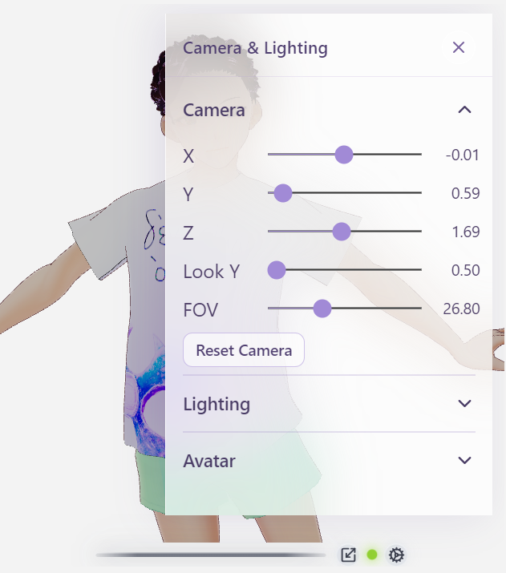
  
  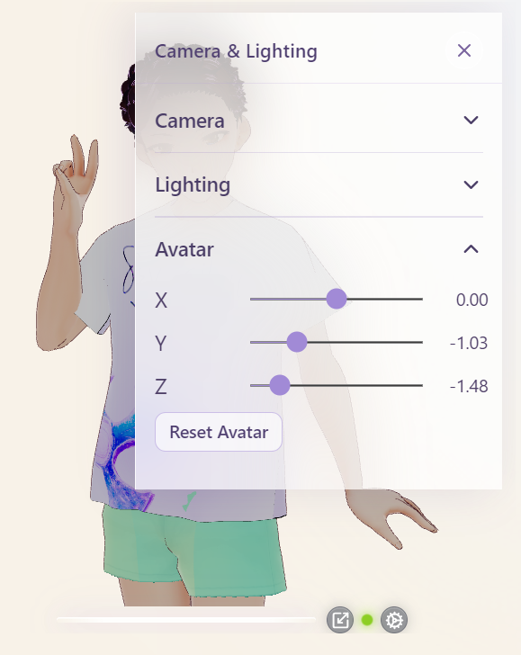
</p>

<p align="center">
  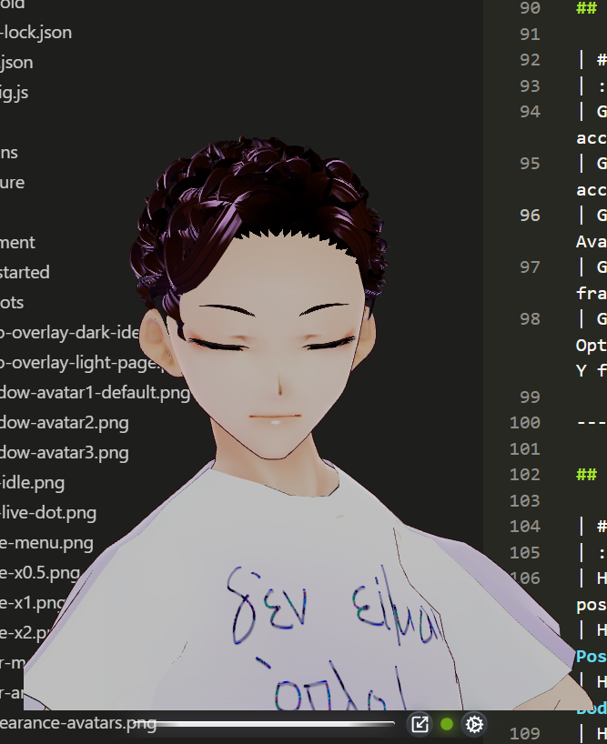
  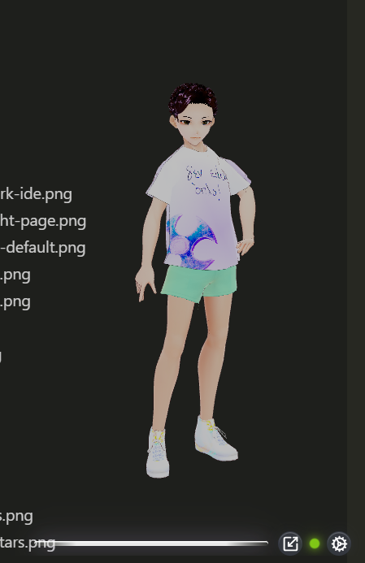
</p>

---

## 6. Animations

Gear → **Animations**.

### Default (recommended)

1. **Greeting** once  
2. Loop: **Model Pose → Show Full Body → Peace Sign → Squat → Shoot**

**Spin** is available as a one-off clip but is **not** in the Default loop.

### Individual clips

Pick any listed VRMA clip to play that motion only. Choosing **Default** again restarts the greeting + loop.

Catalog: [VRMA](animations/vrma.md).

<p align="center">
  
</p>

---

## 7. Settings

Gear → **Settings**.

### Overlay mode (desktop)

- **On (Pinned):** Transparent, always on top — companion over your apps.
- **Off (Windowed):** Opaque lavender window, normal stacking.

Also toggle from the gear **Pinned / Windowed** item.

<p align="center">
  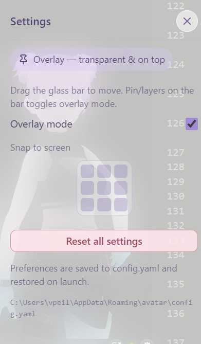
  
</p>

### Snap to screen

Tap a cell in the **3×3 pad**:

```text
Top left     | Top center     | Top right
Center left  | Center         | Center right
Bottom left  | Bottom center  | Bottom right
```

The active cell stays **highlighted**. If you **drag** the glass bar by hand, the highlight clears (no cell selected).

<p align="center">
  
</p>

### Reset all settings

**Reset all settings** wipes saved preferences and restores factory defaults (avatar, skin, animation, environment, camera, light, avatar transform, audio source, overlay, window scale).

### Per-control resets (not “all”)

| Where | Control |
| :--- | :--- |
| Appearance → Environments | **Reset** (color fade) |
| Camera & Lighting → Camera | **Reset Camera** / double-click slider |
| Camera & Lighting → Lighting | **Reset Light** / double-click slider |
| Camera & Lighting → Avatar | **Reset Avatar** / double-click slider |
| Voice | **Restart audio capture** (does not change which source is selected) |

Persistence details: [User settings](user-settings.md).

---

## 8. Everyday workflow (quick)

1. Place the companion with drag or the snap pad.  
2. Set scale ×0.5 / ×1 / ×2.  
3. Appearance → pick avatar (+ skin) and environment.  
4. Voice → Device output (or window/mic) until the green dot appears when sound plays.  
5. Leave **Default** animation running, or pick a single clip.  
6. Nudge Camera if framing feels off; use section resets or **Reset all** if you want a clean slate.

---

## 9. Keyboard / mouse notes

- There is no global hotkey set yet — all actions are pointer-driven.  
- Click outside a drawer/menu (or blur the window on desktop) to dismiss menus.  
- The 3D canvas does not steal drag — move via the glass bar.
