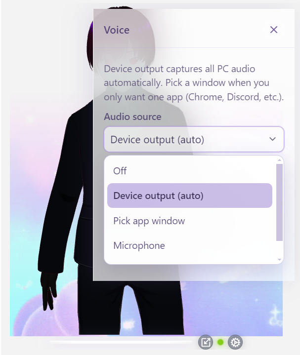
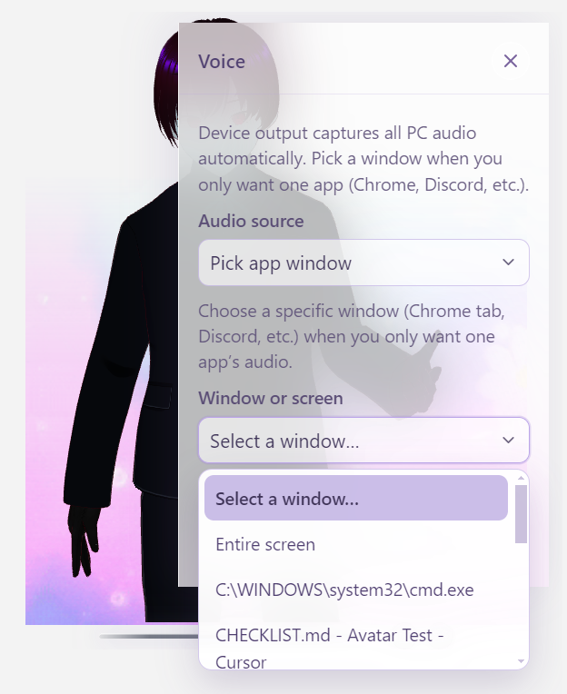
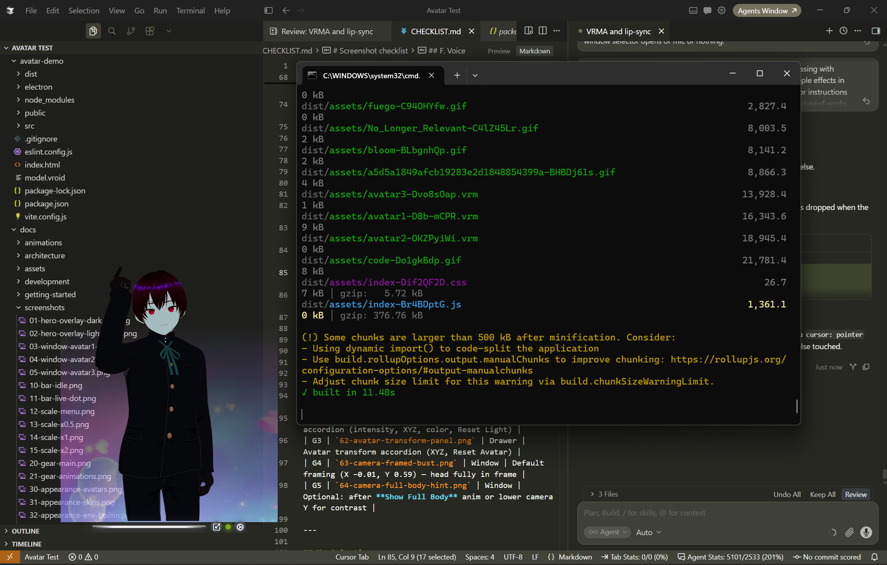

# Audio sources

Gear → **Voice** → **Audio source**.

This is the full reference for every lip-sync input. Mouth shapes themselves are covered in [Lip sync](lip-sync.md). Everyday walkthrough: [Using the app → Voice](../using-the-app.md#4-voice--lip-sync).

  

---

## Desktop (Electron) — recommended

| Option | id | Description |
| :--- | :--- | :--- |
| **Device output (auto)** | `system` | **Default.** Captures what your speakers play (loopback). Best for music, videos, local LLMs talking through the OS mixer. |
| **Pick app window** | `window` | Choose a specific window/screen from the **Window or screen** list, then wait until status is `active`. |
| **Microphone** | `microphone` | Your default input device. |
| **Audio file** | `file` | Pick a local audio file; it plays into the analyser. |
| **Off** | `none` | Lip sync disabled; green live dot hidden. |

  
  
  

### Permissions / troubleshooting

- First capture may prompt for screen/audio permission depending on the OS.  
- If status sticks on `error` or `starting`, click **Restart audio capture**.  
- `awaiting-window` / `awaiting-file` means finish picking a target.

---

## Browser (dev / contributors)

| Option | id | Notes |
| :--- | :--- | :--- |
| **Off** | `none` | **Default** in the browser |
| **Microphone** | `microphone` | Requires getUserMedia permission |
| **Tab or window audio** | `tab` | Browser display-media / tab capture |
| **Audio file** | `file` | Same as desktop |

System-wide **device output** loopback is an Electron feature — use the [Windows installer](https://github.com/ARPAHLS/avatar/releases/download/v0.5.0/AVATAR-Setup-0.5.0.exe) or `npm run desktop` / `npm run dev:desktop`.

---

## Live indicator

When the source is not Off and status is **`active`**, a **green pulsing dot** appears on the glass bar (title: *Lip sync active*).

  
  

---

## Persistence

`audioSourceId` (and `windowSourceId` when relevant) are stored in `config.yaml`.  
Uploaded files are **not** restored after quit — pick the file again.  
[User settings](../user-settings.md).
